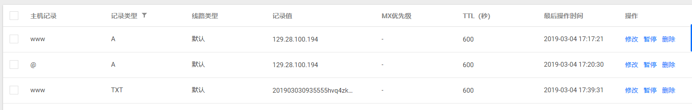

# https协议的服务器

[参考](https://www.cnblogs.com/handongyu/p/6260209.html) <br/>
[老姚文档](https://github.com/Wscats/node-tutorial/tree/master/server/httpsServer)

## 获取私钥证书流程
- 购买服务器
- 购买域名
- 把域名指向服务器IP地址
- 第三条记录为 手动配置证书
- 购买证书

## Express配置

```js
// bin/www
var app = require('../app');
var debug = require('debug')('https-server:server');
var http = require('http');

const path = require('path')
const fs = require('fs')
const https = require('https')

//私钥 需要更改路径
const privateKey = fs.readFileSync(path.join(__dirname, '../certificate/3_www.qoob.xyz.key'), 'utf8')
//证书 需要更改路径
const certificate = fs.readFileSync(path.join(__dirname, '../certificate/2_www.qoob.xyz.crt'), 'utf8')
const credentials = {
  key: privateKey,
  cert: certificate,
}

//端口一定为443
var port = normalizePort(process.env.PORT || '443');
app.set('port', port);


const server = https.createServer(credentials, app)

server.listen(port, () => {
  console.log(`HTTPS Server is running on: https://localhost:${port}`)
})


function normalizePort(val) {
  var port = parseInt(val, 10);

  if (isNaN(port)) {
    // named pipe
    return val;
  }

  if (port >= 0) {
    // port number
    return port;
  }

  return false;
}

```

